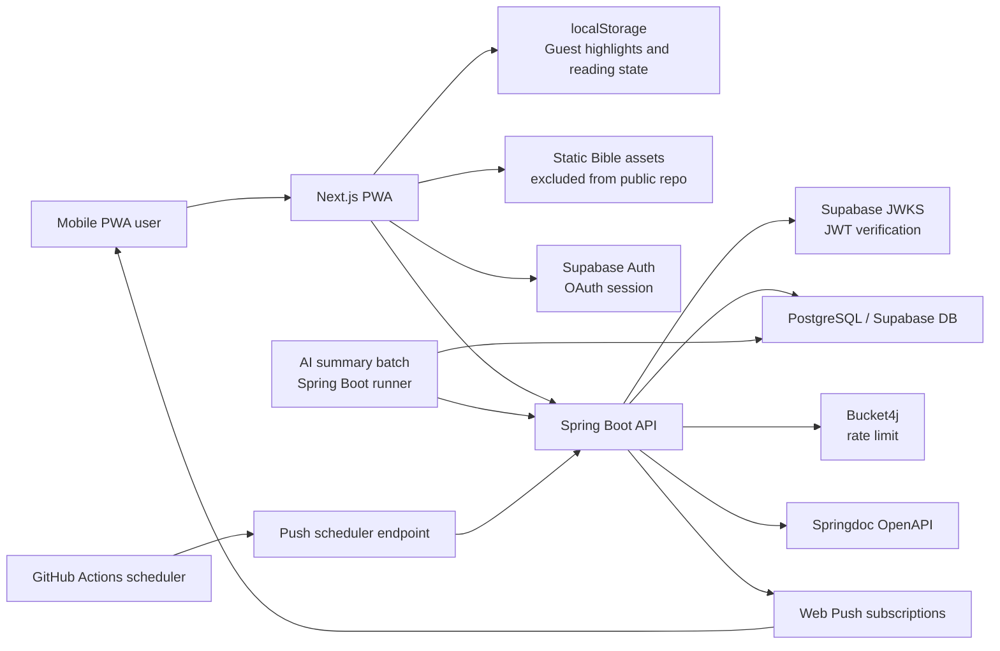
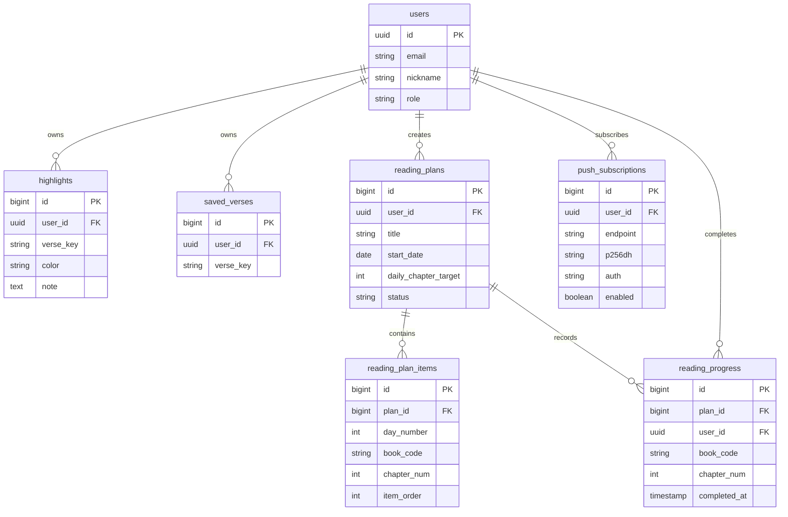

# Beautiful Bible Portfolio

Beautiful Bible은 실제 교회 교인 114명을 대상으로 운영한 모바일 성경 읽기 PWA 프로젝트입니다.
이 공개 repository는 실서비스 코드를 포트폴리오 검토용으로 정리한 버전이며, 저작권 보호 대상 성경 본문과 운영 데이터는 포함하지 않습니다.

## 한눈에 보기

| 구분 | 내용 |
| --- | --- |
| 운영 경험 | 실제 교회 교인 114명 대상 운영 경험 |
| 제품 범위 | 성경 읽기, 검색, 하이라이트/저장, 오늘의 말씀 알림, 개인 통독 MVP, 영어 역본 대조, TTS 듣기 |
| 프론트엔드 | Next.js 15, React 19, TypeScript, Tailwind CSS, PWA, localStorage, Web Speech API |
| 백엔드 | Java 21, Spring Boot 3.5, Spring Security, Spring Data JPA, PostgreSQL, Supabase JWT 검증 |
| 인프라 | Vercel, Render, Supabase, Web Push, GitHub Actions scheduler |
| 포트폴리오 포인트 | 인증/JWT 검증, 사용자 데이터 모델링, AI 콘텐츠 배치 파이프라인, 통독 DB 설계, 검색 개선, 알림 스케줄링, 운영 제약 대응 |

## 프로젝트 배경

기존 성경 앱에서 우리 교회 사용자가 원하는 읽기 흐름과 통독 경험을 충분히 제공하지 못한다는 문제에서 시작했습니다.
처음에는 성경 읽기와 하이라이트 기능 중심이었고, 이후 실제 사용성을 확인하며 검색, 저장한 말씀, 오늘의 말씀 알림, 개인 통독, 역본 비교, TTS까지 확장했습니다.

이 repository는 "서비스 소개 페이지"보다 백엔드 포트폴리오 검토에 초점을 둡니다.
실제 사용자 데이터를 다루는 과정에서 인증, API 계약, 데이터 모델, 무료 서버 운영 제약, 저작권 데이터 분리 같은 결정을 어떻게 했는지 설명하는 데 중점을 둡니다.

## Backend Portfolio Highlights

### 인증과 JWT 검증

- 프론트엔드는 Supabase Auth를 사용하고, 백엔드는 Supabase JWKS 공개키로 JWT를 검증합니다.
- 커스텀 로그인/회원가입 API를 만들지 않고 외부 인증 제공자와 Spring Security를 연동했습니다.
- 인증이 필요한 사용자 데이터 API와 공개 조회 API를 Spring Security 설정에서 분리했습니다.

### 사용자 데이터 모델링

- 하이라이트, 저장한 말씀, 사용자 설정, 통독 진행률, push 구독을 사용자 기준으로 분리했습니다.
- 성경 구절은 `verse_key`를 공통 식별자로 사용해 하이라이트, 저장, 통독, 역본 대조 기능이 같은 절 위치를 공유합니다.
- 비로그인 사용자는 localStorage로 읽기 경험을 유지하고, 로그인 이후에는 API 저장소로 동기화합니다.

### AI 콘텐츠 배치 파이프라인

- 전체 1,189개 장 요약을 런타임 LLM 호출이 아니라 사전 생성 후 DB 조회하는 정적 콘텐츠로 설계했습니다.
- Spring Boot 배치가 본문 수집, AI 요청, rule validation, 후보 저장을 조율하고, `chapter_summary_candidates`와 `chapter_summaries`를 분리했습니다.
- `gpt-5-nano` 기반 생성 결과를 50개 단위로 나누어 확인하고, `PASS + PENDING` 후보만 승인해 서비스 테이블에 반영했습니다.

### 개인 통독 MVP

- 단체 통독보다 운영 부담이 낮고 즉시 검증 가능한 개인 통독 MVP를 먼저 구현했습니다.
- `reading_plans`, `reading_plan_items`, `reading_progress`를 분리해 계획 데이터와 완료 기록을 독립적으로 저장합니다.
- 사용자당 진행 중 계획 1개 제한은 partial unique index로 DB 레벨에서 보장하도록 설계했습니다.

### 검색 개선

- 초기에는 LIKE 기반 검색으로 시작하고, 이후 PostgreSQL Full Text Search와 GIN index를 적용했습니다.
- API 응답 계약은 유지한 채 내부 검색 구현을 개선해 프론트엔드 영향 없이 성능 개선을 진행했습니다.
- 책 바로가기 UX와 본문 검색 UX를 한 화면에서 처리하도록 설계했습니다.

### 알림 스케줄링

- 오늘의 말씀 후보군 API와 Web Push 구독 저장 API를 분리했습니다.
- GitHub Actions scheduler가 Render 백엔드의 push 발송 endpoint를 호출하는 구조로 오전 알림을 발송합니다.
- 무료 서버 cold start와 모바일 PWA 알림 제약을 고려해 실패 가능성을 문서화하고 운영했습니다.

### 운영 제약 대응

- Render 무료 서버, Vercel, Supabase 조합에서 비용을 낮추며 실제 사용성을 검증했습니다.
- 브라우저 Web Speech API 기반 TTS로 서버 비용과 음성 파일 저장 문제를 피했습니다.
- 공개 포트폴리오 repository와 실서비스 private repository의 데이터 범위를 분리했습니다.

## Main Features

### Bible Reading

- 책/장 단위 성경 읽기
- 모바일 중심 읽기 화면
- 화면 모드와 글씨 크기 조절
- 구절 선택 후 하이라이트, 저장, 복사, 공유
- localStorage 기반 비로그인 사용 지원

### Search

- 성경 본문 검색
- 책 바로가기 UX
- PostgreSQL Full Text Search 기반 검색 개선
- 검색 API 응답 계약을 유지한 상태에서 내부 검색 구현 교체

### User Data

- 하이라이트 CRUD
- 저장한 말씀
- 사용자 설정 저장
- 로그인 시 API 저장소 사용
- 비로그인 localStorage와 로그인 API 저장소 분리
- 첫 로그인 시 localStorage 데이터를 서버로 동기화하는 흐름

### AI Content

- 전체 1,189개 장 요약 사전 생성
- 후보 테이블과 최종 테이블 분리
- rule validation과 운영 승인 단계로 품질 게이트 구성
- 66권 책 요약과 16명 인물 해설 콘텐츠 API 제공

### Personal Reading Plan

- 사용자가 읽을 성경책을 선택해 개인 통독 계획 생성
- 하루 목표 장 수 기반 계획 생성
- 장 단위 완료 기록
- 사용자당 진행 중 통독 계획 1개 제한
- 통독표와 이어 읽기 흐름 제공

### Today Verse & Push Notification

- 오늘의 말씀 후보군 기반 조회 API
- Web Push 구독 저장
- GitHub Actions scheduler로 오전 알림 발송
- Render 무료 서버의 cold start를 고려한 안내 UX

### WEB Translation Comparison

- Public domain WEB 역본을 활용한 영어 대조 읽기
- 기존 `verse_key` 구조를 유지하며 한국어/영어 본문 연결
- 서버 호출 없이 정적 데이터 기반으로 읽기 경험 제공

### TTS Reading

- 외부 TTS API 없이 브라우저 내장 Web Speech API 사용
- 장 단위 듣기 시작
- 구절 클릭 점프
- 이전/다음 절 이동
- 일시정지/이어듣기
- 속도 조절
- 모바일 하단 플레이어 UI

## Architecture

### System Diagram



### Core User Data ERD

실제 Supabase public schema에는 16개 테이블이 있습니다.
아래 ERD는 포트폴리오 설명을 위해 사용자 데이터와 개인화 흐름 중심으로 축약한 핵심 ERD입니다.



### Table Inventory

| 영역 | 테이블 |
| --- | --- |
| Bible data | `bible_books`, `bible_chapters`, `bible_verses` |
| AI content | `book_summaries`, `chapter_summaries`, `chapter_summary_candidates`, `person_commentaries` |
| User data | `users`, `user_preferences`, `highlights`, `saved_verses` |
| Reading plan | `reading_plans`, `reading_plan_items`, `reading_progress` |
| Re-engagement | `today_verse_candidates`, `push_subscriptions` |

## Tech Stack

### Frontend

- Next.js 15
- React 19
- TypeScript
- Tailwind CSS
- PWA
- Supabase Auth client
- Browser Web Speech API

### Backend

- Java 21
- Spring Boot 3.5
- Spring Security
- Spring Data JPA
- PostgreSQL
- Supabase JWT verification via JWKS / ES256
- Springdoc OpenAPI
- Bucket4j rate limit

### Infrastructure

- Frontend: Vercel
- Backend: Render
- Database/Auth: Supabase
- Push: Web Push + GitHub Actions scheduler

## Screenshots / GIF

스크린샷과 GIF는 포트폴리오 페이지 또는 별도 문서에 정리할 예정입니다.
저작권 보호 대상 본문이 길게 노출되지 않도록 본문 영역은 crop 또는 blur 처리하고, 기능 흐름 중심으로 캡처합니다.

| 화면 | 보여줄 내용 | 안전 처리 원칙 |
| --- | --- | --- |
| 홈 | 오늘의 말씀, 나의 통독, 주요 진입점 | 긴 본문 노출 최소화 |
| 성경 읽기 | 장 단위 읽기, 구절 선택 액션, 하이라이트 | 본문은 일부만 crop 또는 blur |
| 개인 통독 | 계획 생성, 진도표, 성경통독표 | 사용자 식별 정보 제거 |
| TTS | 재생 상태, 절 이동, 모바일 하단 플레이어 | 본문보다 컨트롤 UI 중심 |
| 설정/마이페이지 | 로그인 상태, 저장 데이터 진입점 | 계정 정보 마스킹 |

## Data / Copyright Policy

공개 repository에는 저작권 보호 대상 성경 본문 데이터와 운영 데이터를 포함하지 않습니다.
실서비스 운영 URL은 요청 시 제한적으로 공유할 수 있습니다.

제외한 대표 데이터:

- `bb-bible-frontend/public/bible.json`
- `bb-bible-frontend/public/bible-webp.json`
- `bb-bible-backend/src/main/resources/data/bible.json`

공개 데모가 필요한 경우 public domain 역본, 개역한글, WEB, 또는 샘플 데이터를 주입하는 방식으로 분리할 수 있습니다.

## Key Decisions

### 1. 개인 통독을 먼저 구현

단체 통독은 초대, 멤버 진행률, 알림, 서버 부하, 운영 비용이 함께 늘어납니다.
무료 서버에서 실제 사용성을 검증하는 단계였기 때문에 개인 통독 MVP를 먼저 구현하고, 단체 통독은 후원/유료 서버 전환 이후로 미뤘습니다.

### 2. 공개 repo에서 성경 본문 데이터 제외

실서비스는 교회 사용성을 위해 저작권 보호 대상 한국어 본문을 기준으로 설계했지만, 공개 포트폴리오 repo에는 해당 본문 데이터를 포함하지 않기로 했습니다.
대신 코드 구조, API 설계, DB 모델링, 운영 의사결정을 중심으로 프로젝트를 설명합니다.

### 3. 외부 TTS API 대신 브라우저 TTS 사용

서버 TTS는 비용, 캐시, 음성 파일 저장, 성경 본문 사용권 문제가 함께 생깁니다.
MVP에서는 브라우저 Web Speech API로 듣기 경험을 먼저 검증하고, 서버 TTS는 후속 확장으로 분리했습니다.

### 4. 실제 운영과 포트폴리오 공개 범위 분리

운영 버전은 실제 교회 사용자와 운영 데이터를 다루므로 private로 유지합니다.
포트폴리오 버전은 공개 가능한 코드와 설계 설명 중심으로 구성합니다.

## Project Notes

자세한 의사결정 기록은 `docs/dev-notes`에서 확인할 수 있습니다.

추천해서 볼 문서:

- `docs/dev-notes/portfolio-index.md`
- `docs/dev-notes/97-full-chapter-summary-generation.md`
- `docs/dev-notes/194-bible-copyright-data-policy.md`
- `docs/dev-notes/188-tts-mvp.md`
- `docs/dev-notes/183-web-translation-comparison-ui.md`
- `docs/dev-notes/164-reading-plan-backend-mvp.md`

## How To Run

이 공개 repository에는 전체 성경 본문 데이터가 포함되어 있지 않습니다.
로컬에서 전체 기능을 실행하려면 공개 가능한 샘플 데이터 또는 별도 허가를 받은 성경 본문 데이터를 준비해야 합니다.

### Frontend

```bash
cd bb-bible-frontend
npm install
npm run dev
```

### Backend

```bash
cd bb-bible-backend
./gradlew bootRun
```

## Portfolio Summary

이 프로젝트는 단순한 성경 읽기 앱이 아니라, 실제 사용자 요구와 운영 제약을 바탕으로 기능을 점진적으로 확장한 서비스입니다.

백엔드 관점에서는 인증, 사용자 데이터 영속화, AI 콘텐츠 배치/검수 파이프라인, 검색 개선, 통독 데이터 모델링, 알림 스케줄링, 배포 환경 제약 대응을 경험했습니다.
프론트엔드 관점에서는 모바일 PWA, local-first UX, 읽기 경험, TTS, 역본 비교, 통독 흐름을 구현했습니다.

가장 큰 학습 포인트는 기능 구현 자체보다, 실제 서비스를 공개할 때 필요한 데이터 저작권, 운영 비용, 배포 환경, 사용자 경험의 균형을 판단하는 과정이었습니다.
